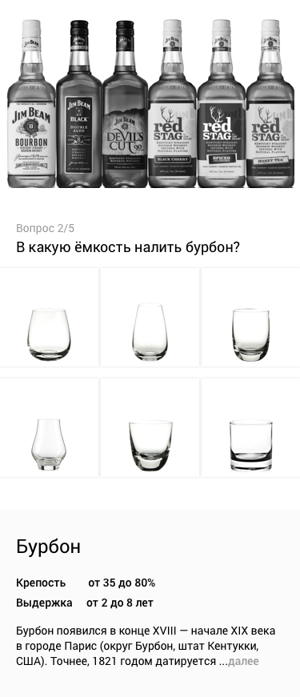

#Задача

Спроектируйте приложение приложение для официантов и барменов. При запуске, после нажатия на старт, появляется вопрос типа: В какую ёмкость налить абсент (бурбон, кальвадос, лимонад итд). К каждому напитку - картинка с бутылками известных производителей, крепость (3) и история напитка. При клике на картинку подходящей емкости (6 вариантов) - следующий вопрос. После последнего из 15 вопросов - списком все вопросы с правильными и неправильными ответами с пояснениями

##Объектная модель

#####Емкость

*  Схематичное изображение

#####Напиток

* Название
* Пример бутылки/упаковки
* Описание и история
* Крепость

Состояния:

* Емкость выбрана / не выбрана
* Ответ верный / неверный

#Решение

#####Открываем приложение.

Добавить:
* Статистику
* «Энциклопедию» напитков ?

#####Начинаем играть.

Здесь мы видим страницу с вопросом, вариантами ответа и информацией о напитке.

При выборе емкости, квадрат подсвечивается.

У алкогольных напитков в информации дополнительная информация о крепости напитка и сроках выдержки.

#####Результаты.

На странице результатов сначала выводится общее количество правильных ответов, а затем идут подробные объяснения.
