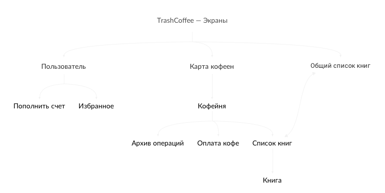
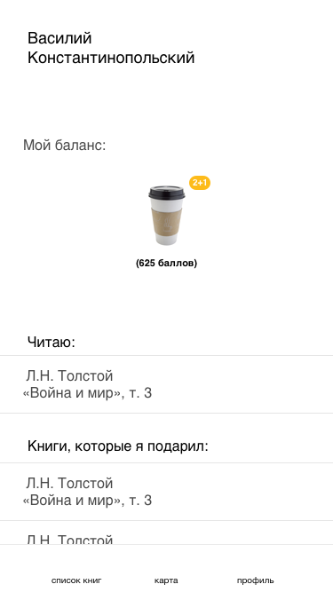
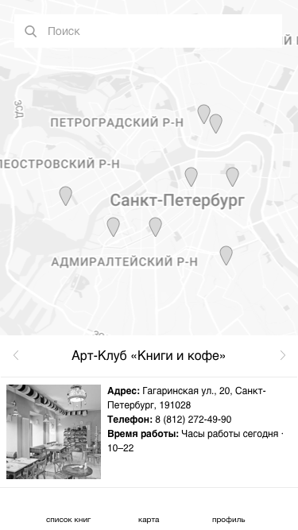
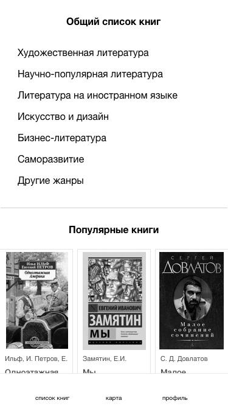
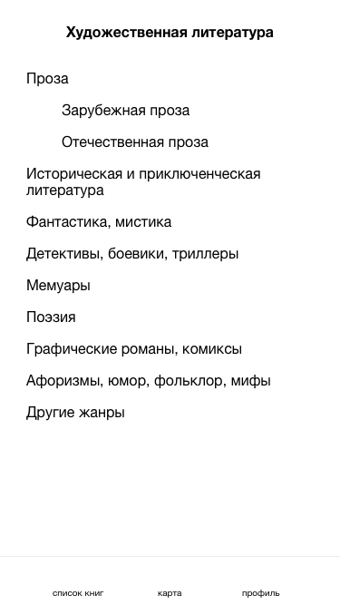
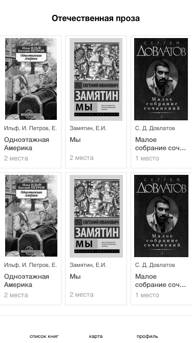
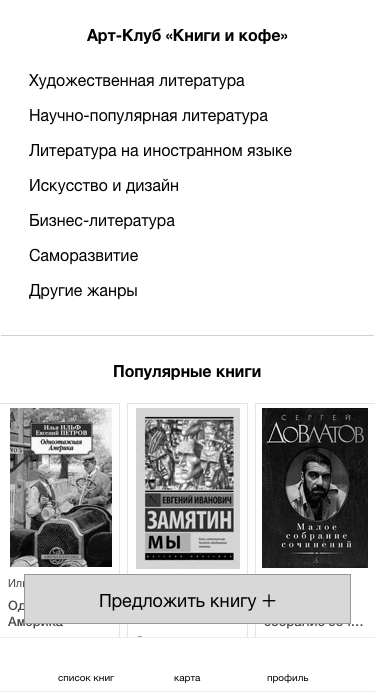
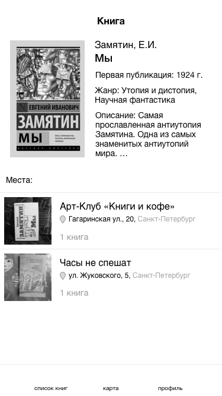
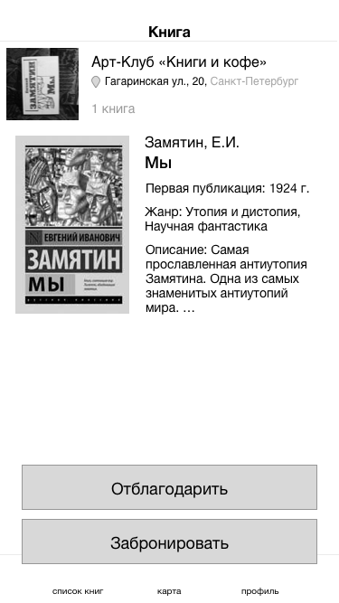

#О приложении

[Issues](https://github.com/zorenko/homework/issues/4)

Идея похожа на буккроссинг, только более организованный.

###Что будет:
* Карта кофеен города, которые, например, купили подписку.
* Профили пользователей, с кофейными и книжными предпочтениями.
* Электронный список книг, которые в данный момент есть в доступе.
* Электронный список книжных пожеланий от зарегистрированных пользователей

###Как это будет работать:

Я приношу классные и полезные книжки, которые жалко раздавать просто так, в любимую кофейню. Книги появляются в списке и на карте города. Человек, который хочет забрать заинтересовавшую его книгу, заходит в кофейню и оплачивает кофе для меня.И с чистой совестью забирает книгу себе.
У него - крутая книга по цене чашки кофе, у меня - кофе и радость от того, что книга будет полезной для кого-то еще.
Ну а кофейня радуется тому, что к ним заходят люди, которые могли бы пройти мимо, совершают покупку, а возможно и не одну.
И всем хорошо.

https://coggle.it/diagram/WF_ZDcfYD4NbeDgu

##Объектная модель

###Книга

🚥 доступна / не доступна 

🔸 Название 
🔸 Автор 
🔸 Описание 
🔸 Год издания 
🔸 Обложка 
🔶 Пользователь, отдавший книгу 
🔶 Пользователь, забравший книгу 
🔶 Электронный список книг 
🔶 Архив операций 
⚡️ Забронировать книгу  
⚡️ Предложить книгу  
⚡️ Вернуть книгу  
⚡️ Пожаловаться  

###Кофе

🔸 Название 
🔸 Изображение 
🔸 Стоимость 
🔶 Архив операций 
⚡️ «Отправить» кофе (от пользователя, который взял книгу)  
⚡️ «Получить» кофе (для пользователя, который принес книгу)  

###Кофейня

🔸 Название 
🔸 Изображение 
🔸 Адрес 
🔸 Время работы 
🔶 Электронный список книг 
🔶 Архив операций 
⚡️ Добавить кофейню в избранное  
⚡️ Посмотреть электронный список книг  

###Пользователь

🔸 Имя 
🔶 Книга 
🔶 Архив операций 

###Список книг кофейни

🔶 Книги, доступные для брони 
🔶 Книги, не доступные для брони 
🔶 Запрошенные книги 

###Архив операций

🔶 Книга  
🔶 Кофе («отправленное»)  
🔶 Кофе («полученное»)  
🔶 Пользователь  

#Экраны

В приложении три главных экрана: **экран пользователя**, **экран с картой кофеен** и **экран с общим списком книг**. 

###Страница входа

###Экран пользователя
Здесь пользователь может пополнять свой счет, смотреть избранные кофейни, книги, кофе.
 

###Карта/список кофеен
По карте пользователь может найти кофейню и перейти на ее страницу.

###Общий список книг
Здесь можно найти книги, доступные во всех кофейнях
  
 

###Страница кофейни
Содержит общую информацию о кофейне, электронный список книг и архив операций.
Через страницу кофейни можно оплатить кофе человеку, который пожертвовал книгу.

Перейти в архив операций.

###Список книг кофейни
Содержит информацию о книгах.
Здесь же можно предложить свою книгу.

###Книга
Содержит информацию о книге, о том, в какой кофейне она находится.
Здесь можно забронировать книгу.
 

###Оплата кофе
Купить кофе

###Архив операций

